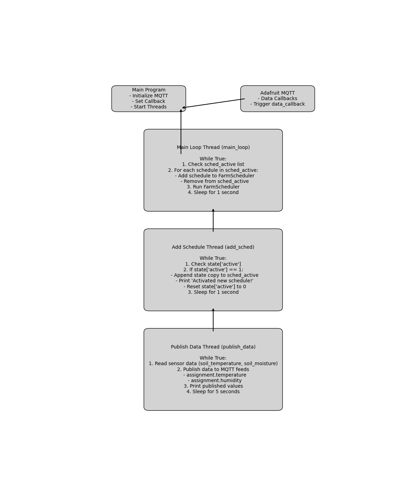

# Smart Irrigation Controller

## Overview
The Smart Irrigation Controller is a sophisticated system designed to automate and optimize irrigation processes in agricultural and horticultural settings. Utilizing the Adafruit MQTT platform, this controller enables real-time data communication and control over irrigation components. The system schedules irrigation cycles, monitors and adjusts the status of mixers and pumps, and collects sensor data to maintain optimal soil conditions.

## Features
- State Management: Dynamically updates and tracks the status and settings of irrigation components.
- Data Callback Handling: Processes incoming MQTT data to update the system state.
- Scheduling: Uses a finite state machine (FSM) to manage and execute irrigation schedules.
- Sensor Data Publishing: Collects and publishes real-time sensor data to MQTT feeds.
- Multithreading: Concurrently runs multiple threads to ensure efficient and smooth operation.

## Components
- Adafruit MQTT: For data communication and callbacks.
- Finite State Machine (FSM): Manages state transitions and schedule execution.
- Physical Sensors: Monitors soil conditions (temperature and moisture).

## Files and Structure
- `main.py`: Main script that initializes the system and starts the threads.
- `adafruit.py`: Handles MQTT communication.
- `timer.py`: Manages timing functions.
- `fsm.py`: Contains the finite state machine for scheduling.
- `rs485.py`: Communicates with sensors over the RS485 protocol.
- `README.md`: Documentation for the project.

## Thread Flow Diagram


## How It Works
1. Initialization:
   - The main program initializes the Adafruit MQTT client and sets the data callback function.
   - Three main threads are started: `main_loop_thread`, `add_sched_thread`, and `publish_thread`.

2. Data Callback Handling:
   - Incoming MQTT messages trigger the `data_callback` function, which updates the `state` dictionary.

3. Main Loop Thread:
   - Continuously checks for active schedules and processes them using the `FarmScheduler` instance.
   - Runs the scheduler and sleeps for 1 second before repeating.

4. Add Schedule Thread:
   - Monitors the `state` for new schedule activations and adds them to the `sched_active` list.
   - Resets the `active` flag and sleeps for 1 second before repeating.

5. Publish Data Thread:
   - Continuously reads sensor data and publishes it to the MQTT feeds.
   - Sleeps for 5 seconds before repeating.

## Setup and Usage
1. Install Dependencies:
   ```bash
   pip install adafruit-io
   pip install pyserial
   pip install paho-mqtt
   ```

2. **Configure MQTT**:
   - Set up your Adafruit IO account and obtain your MQTT credentials.
   - Update the MQTT client initialization in the script with your credentials.

3. **Run the System**:
   ```bash
   python main.py
   ```


